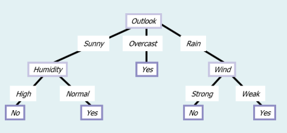
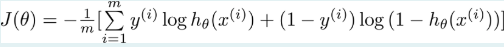

#### ML Quiz Review - Exact Questions

#flashcards/ML/Quiz/L01
**Q1.1** *In the classification algorithm K-NN, the parameter k determines:*

a) The dimensions of the function space
b) The number of classes
c) The iterations of the algorithm
d) The number of features in the input vector
e) The neighbor examples used to predict the class
?
**e) The neighbor examples used to predict the class** ✓

#flashcards/ML/Quiz/L01
**Q1.2** *Complete: An algorithm is said to (blank) from (blank) E, with respect to some (blank) T, and some (blank) measure P, if its performance on T as measured by P (blank) with experience E.*

Choices: *task, performance, learn, improves, experience*
?
An algorithm is said to **learn** from **experience** E, with respect to some **task** T, and some **performance** measure P, if its performance on T as measured by P **improves** with experience E.

#flashcards/ML/Quiz/L01
**Q1.3** *Match each concept to its description:*

- Regression
- Unsupervised learning
- Classification
- Supervised learning

Choices:
- Task of drawing inferences from datasets consisting of input data without labeled responses
- Task of predicting a continuous value given input-output example pairs
- Task of predicting a discrete value given input-output example pairs
- Task of learning a function based on example input-output pairs
?
- **Regression** → Task of predicting a continuous value given input-output example pairs
- **Unsupervised learning** → Task of drawing inferences from datasets consisting of input data without labeled responses
- **Classification** → Task of predicting a discrete value given input-output example pairs
- **Supervised learning** → Task of learning a function based on example input-output pairs

#flashcards/ML/Quiz/L01
**Q1.4** *The notation $x^{(i)}$ refers to:*

a) The prediction of regression for input x
b) The i-th component of a vector
c) The i-th cluster in the data
d) The i-th example from a dataset
e) The prediction of classification for input x
?
**d) The i-th example from a dataset** ✓

#flashcards/ML/Quiz/L02
**Q2.1** *The goal in Linear Regression is to (blank) the cost function.*
?
**minimize**

#flashcards/ML/Quiz/L02
**Q2.2** *In Linear Regression, associated to each hypothesis function there is a:*
Select One:
a) Optimization algorithm
b) Dataset
c) Cost value
d) Training example
e) Notation
?
**c) Cost value** ✓

#flashcards/ML/Quiz/L02
**Q2.3** *Regression should be used when you have data WITHOUT labels.*

a) True
b) False
?
**b) False** ✓

Explanation: Regression is a supervised learning technique that requires labeled data.

#flashcards/ML/Quiz/L02
**Q2.4** *The mean squared error tells you how close a regression line is to a set of points.*

a) True
b) False
?
**a) True** ✓

#flashcards/ML/Quiz/L02
**Q2.5** *How many parameters has the hypothesis function in an univariate linear regression problem?*
Select One:
a) 0
b) 2
c) 1
d) 5
e) 3
?
**b) 2** ✓ (θ₀ and θ₁)

#flashcards/ML/Quiz/L03
**Q3.1** *Match each notation element to its description:*

- $x^{(i)}$
- n
- m
- $x_{j}^{(i)}$

Choices:
- input of i-th training example
- Number of features
- Number of training examples
- value of feature j in i-th training example
?
- **$x^{(i)}$** → input of i-th training example
- **n** → Number of features
- **m** → Number of training examples
- **$x_{j}^{(i)}$** → value of feature j in i-th training example

#flashcards/ML/Quiz/L03
**Q3.2** *In a univariate linear regression problem, how many variables has the optimization problem solved by gradient descent?*
Select One:
a) 2 Variables
b) 0 Variables
c) 1 Variable
d) 3 Variables
e) Depends on the problem
?
**a) 2 Variables** ✓ (θ₀ and θ₁)

#flashcards/ML/Quiz/L03
**Q3.3** *When the number of training examples in your dataset is very large you should:*

a) Apply K-NN
b) Reduce your dataset
c) Use the Normal Equation Method
d) Apply Multivariate Linear Regression
e) Use Gradient Descent to minimize the cost function
?
**e) Use Gradient Descent to minimize the cost function** ✓

#flashcards/ML/Quiz/L03
**Q3.4** *In gradient descent the parameter alpha multiplies the partial derivative of the cost function.*

a) True
b) False
?
**a) True** ✓

#flashcards/ML/Quiz/L03
**Q3.5** *Match each case with the corresponding cause for gradient descent:*

- Gradient descent will converge to a local optimum
- Gradient descent may take too long to converge
- Gradient descent may not converge or even diverge

Choices:
- If alpha is right
- If alpha is too small
- If alpha is too large
?
- **Gradient descent will converge to a local optimum** → If alpha is right
- **Gradient descent may take too long to converge** → If alpha is too small
- **Gradient descent may not converge or even diverge** → If alpha is too large

#flashcards/ML/Quiz/L03
**Q3.6** *Select the statements that are true about Polynomial Regression:*

a) Allows the model to learn non-linear hypothesis
b) Creates new features based on existing ones
c) Is faster than Linear Regression
d) New features don't need to be scaled
e) Does not require Gradient Descent
?
**Correct answers:**
- **a) Allows the model to learn non-linear hypothesis** ✓
- **b) Creates new features based on existing ones** ✓

#flashcards/ML/Quiz/L03
**Q3.7** *Match the dataset types to their purposes:*

Dataset Types:
- Training set
- Validation set
- Test set

Purposes:
- Used for selecting the best model
- Used for reporting the accuracy of the model
- Used for finding the best parameters values of the model
?
- **Training set** → Used for finding the best parameters values of the model
- **Validation set** → Used for selecting the best model
- **Test set** → Used for reporting the accuracy of the model

#flashcards/ML/Quiz/L03
**Q3.8** *The purpose of feature scaling is to have all the features in a similar scale.*

a) True
b) False
?
**a) True** ✓

#flashcards/ML/Quiz/L03
**Q3.9** *In K-fold cross-validation the highest accuracy among the different folds is reported.*

a) True
b) False
?
**b) False** ✓

Explanation: The **average** accuracy across all folds is reported.

#flashcards/ML/Quiz/L05
**Q5.1** *Select true statements about Naive Bayes classifier:*

a) Naive Bayes assumes that attribute values are conditionally independent given the target value
b) Naive Bayes has proven to be effective for text classification
c) When conditional independence is satisfied, Naive Bayes corresponds to MAP classification
d) An unseen instance is classified by computing the class that maximizes the posterior probability
?
**All are correct:**
- **a) Naive Bayes assumes that attribute values are conditionally independent given the target value** ✓
- **b) Naive Bayes has proven to be effective for text classification** ✓
- **c) When conditional independence is satisfied, Naive Bayes corresponds to MAP classification** ✓
- **d) An unseen instance is classified by computing the class that maximizes the posterior probability** ✓

#flashcards/ML/Quiz/L05
**Q5.2** *Assuming that all hypotheses are equally probable a priori is called (blank) prior.*
?
**uniform**

#flashcards/ML/Quiz/L05
**Q5.3** *Using Bayesian analysis it can be shown that under certain assumptions any learning algorithm that minimizes the squared error between the prediction and the training data will output a maximum likelihood hypothesis.*

a) True
b) False
?
**a) True** ✓

#flashcards/ML/Quiz/L05
**Q5.4** *Which expression corresponds to the Bayes theorem?*

a) P(D|h) = P(h|D) * P(h) / P(D)
b) P(h|D) = P(D|h) * P(h) / P(D)
c) P(h|D) = P(D) * P(h)
d) P(h|D) + P(D|h) = P(h) / P(D)
e) P(D) = P(D|h) * P(D) / P(D|h)
?
**b) P(h|D) = P(D|h) * P(h) / P(D)**

#flashcards/ML/Quiz/L05
**Q5.5** *MAP stands for Maximum A (blank) hypothesis.*
?
**Posterior** (Maximum A Posteriori)

#flashcards/ML/Quiz/L06
**Q6.1** *Select statements that apply to ID3:*

a) ID3 is a recursive algorithm
b) ID3 is a greedy algorithm
c) ID3 favors short hypothesis
?
**All are correct:**
- **a) ID3 is a recursive algorithm** ✓
- **b) ID3 is a greedy algorithm** ✓
- **c) ID3 favors short hypothesis** ✓

#flashcards/ML/Quiz/L06
**Q6.2** *Decision Trees allow representing the learned hypothesis as a set of logic rules.*

a) True
b) False
?
**a) True** ✓

#flashcards/ML/Quiz/L06
**Q6.3** *What is calculated using this equation?*

![](data:image/png;base64,iVBORw0KGgoAAAANSUhEUgAAALgAAABcCAYAAADd5n9TAAALK0lEQVR4Ae2dK5AVPxPFVyKRSCQSiUQikUgkEolDIpFIJBKJRCKRSCQSibz/+u33na0mdOaZyWNup2pq7s4j6T590ul0ZmZvLlECgRMjcHNi3UK1QOASBA8SnBqBoQj+/fv3y4sXLy4PHz683Nzc3O7fvXt3agOFcvsQGIbgnz59uty7d+/y5s2by+/fvy8/fvy4Jfn79+/3IRB3nxqBIQj+7du3WzJDblvevn17+fnzpz0UvwOBvxAYguBPnjy59d6/fv36S/j4IxCYQ6B7gisUef78+ZwucT4Q+AeB7glO7M2EMiaT/9guDixAYBiCf/jwYYE6cUkg8DcC3ROcSSQe/OXLl3eSk0UhXRgZlDtI4kcGge4JjtxMMiH506dPL69fv748ePDgdp/RKQ4HAncIDEFwPDYxOF6bPQs+UQKBJQgMQfAlisQ1gYCHQBDcQyWOnQaBIPhpTBmKeAgEwT1U4thpEAiCn8aUoYiHQBDcQyWOnQaB6gQnj00+u/ZGijHK9SFQneCsSLJoU3vjJYko14dAdYKzaKM3ckRyvHnpwjPkjx8/vutIQfDSCI9RX3WCAwvk4+0cEZz9Ec+V8ByL2gmCj0HI0lI2IThKQGhLcIgI8UuXV69e3bYTBC+N7Bj1NSM48PASgyU5JCSEKVm+fv0aBC8J6GB1NSW4F4+XfnOHNuhE4cEHY2YhcZsSHB28ePzjx4+F1PtfNaQII01YFNJhKmtOcJDy4nHexYwSCOxFoAuCowSpQhuPP3r06PLnz5+9+sX9V45ANwTnkxC8qWNJbl9Tu3I7hfobEeiG4MivjIcleel4fCNOcdugCHRFcDDka1WW4Pfv34+vVw1ALrJV2O5oh0SyAEe4tHRHcARP43FeOo54fKlJ616HXSA2jgg7HbFYJ41oi3dy1dYSondJcC8e5ynEMxQyRvaJytF1wqOyCn2057Y4wQ/WS2h3juRdEhxlvHj88+fPVs8hf+Ph9BkMQrGRix6DOOI5ojlc8OY8TIc3n0opd41wGo+TZTnDBzi/fPlyN8+YM2Sv5/nSGB20ZaaLh+kgOKvUuRC2a4Jj3DQeP+LR2toksqNT7bZLtadHkVt/vlqjCN+w9Er3BPficTz7yGV0ghNm4b0JtVoXYZmTpXuCA6CUsOlDjo1arD4j6qC3snr54q8WCL0vng1BcEjgxeOlH60FIIa8Z8+eXYiTVRiGyRYQHnFu77C8hOBMnIhz1S57JnO5WBNZlUZDzqlNem3dE/PibOZSgrXwBBvk8Sa7wxAcY2A068VLPlpLmgtPoDb0eC1EJx3Fcfa0PzWpWUKaOYIjC20R55I5QgZ5TZ7R8TwVoRxycR+Gpg3iUnk3hnCcRInwTjaY6ug18STtikxeKnkognvxeInUIYaCODIYpIAoeCh7HK8qkucmNXsJrvgWGdIRipAAQ0L81JPLi7G3BaJxD/Wl99jrlv4GIxE8d09tPIWL5/CGIjiAWu8H0BiwdKFe0k+W3GpDOew9ntDqoHq1x0i073kjvbzB+fQfAshTp3jYe+ZCCskwtZfs4LO0HI2nOrE30cwS3K62TcVz3rnUiywFYul1IgEgy+suvXfuOrw0BmHzYjqFMB7BhVnqedM2RRLaSIviW67xis4zV7BFMtu5g86DE+dLjHaSnQ61pNTAUwTHIaXlX4T/f4UMKeDW7DHCUUUAlzJYKucUWFwLiLSdelDOQaQlulsdbPuEYMLZi7O5lkku17C3RXnptONZDw7ZvEK7kJ972aY8vSWsV1d6rAaeOCIPE2TJEjwVtIe/bQx+1AoaXhiwvBCBGFYxeOphOcexHDEtfjmC2+O5kUmTTRyQLfwPUeROh2nFp+n13Av55cgYFSG3YnmOezE7x2iHLSejlasGntI9HdWQYyiCy3vhRT3wLbBbf8sTpgSmPhFwTfzpyaF6IIktdA6Rx2ufa3MEt+fQAbLqWkjvkZFjtJc6C4WAuYm0Qp4lnbkGntITndPyN8Lp2Y7+1jCEB80NtXvFtcO5F0drWTj17nQ8PB7GnBreJV+O4NY75uJlTXJTb4W8tA9OhE8Ym21KHtpDllRX7oP4HmHQQTIQfkyVWniqE3mYDUFwjKTQYA7UKcDnzuWIx32ER8jAxm9bIApejXNLRpapdmQsb6IOYYQDddhCJ0vDE3t+zW915LQN1aG4Op0H6Lz2U3qWwlOjUC4N2j3BMaoyB57RBWaJvTwX3ssO6cggr+UN25Aa4i0lGJkOhSK2HXSgM3OO+tIQQLEmIYQtah8jUzfE0pbWYe/zfnM9badt2GtthwabXKmBp+YYudGme4IrHoTkU2DmQF5zXDE+BIOsDPUASMyPh/bITf0iZRq6eG0TXmliRzt4y3REwEPSHoTFcPxtJ38eDuqA6jjpnja9FKKVkc4GztQ1NxJp8uhlk1Tn0XgiIyMeHTLFUDJ0TXDAw1AoMBVLSpm9e02eAAsyYEQISFzrkUrtaX7gxYC6RnubjoO8bJ6XhWzUKxkg+dTcQ+k7OiNktpvI7o0KkkvkhjBTuup6rqEt6szJdTSe6mTglCvdEhzQAA/jTCmQU2ztcUhGW0vy2GndGmXScCO97qi/kR1vD6k9zwsZFdt7Q7nOLyW39FCngOhppzgaTxwF9oLkU6VLgmMkQEOBuYnMlHJrzmm0mIo9c/XRKSBYq6I02dQIovjdIzgYpySFsDnPbPWEyNLfhitH4UmnkkNJM0lWLv3ukuAyGKTJxVZSoNRebUKEtYWOiPekEEpg9JpFBp8iOPIhZ0paCE8okY4+4MG2tKA3RGfOQjkCTxwfslJ3qkdOzu4IDlAYgi2Xpsops+c4xqHNLQQnlAJ4iMYELR2u98i15F4mv8iODulcBVLkvLfCCOGd7rdgIYd0FJ6qfwkuXNMVwW3c7Q2lS5Vaex2EtMZdMvTZNvCcZDnsEG3P1/jNpJgOpnkLHptOxyhICJISH5kgODjntq0Opic8uyE4nkapLg33NYhx1jYgdO2RpEcsuyG4Uj5ePNgjcCHTGAh0QXClfAgTpiZKWyHVULx1yN3abtzXHoHmBGf2jteG3HM5za1wEWNSf824fquscV9ZBJoS3MbdS5aHt6quJeMaC0ZbZYz7jkGgKcHlWaeWe/eqrdwpHpwUZJTrQqAZwYmHId3RxFOOmHbmHja6LtNfh7ZNCE6ynvwspFuzWrbWJOTVteBAWzHJXIvg+Nc3IbiWjSEdsTd/l94ssWmHbeny7vhmDQ2EQHWCK+4W6Wru0+ctBELsz4tAVYKzulaT0Glb5zVjaJZDoCrBmeSVDkXW1JcDIY6fF4GqBD8vjKFZrwgEwXu1TMhVBIHmBGd5njAjnnwrYs+oJEGgOcF5DoWU3hGFlcvoOEcgO06dTQnOMjqLL6Vf8aJOvWQbqcFxyHiEpE0JXlohOgoPVjEi6AnFIHhplMeqrxnBISKxN57We51qC4y8aqaP8+hDOUHwLUie555mBNdTfjxJyG8VnlNZmtvWG9y61+71VncQ3KJyfb+bEhxy8yyKLUFwi0b83otAM4Jr2f6ot3jCg++lxjnub0Zw3q7hWZEj3sHENEHwcxB0rxbNCK6vMaUxcoQoe00a91sEmhGcVJ73Pb8guDVP/N6LQDOCE56QLaGw4lh6sUcjROl69wIe99dFoBnByaCwGFPye36EO3QWvqlH/epEvGRRKtde1zzR2l4EmhH8iO/5sUQPmb0tPhmxlypj3t+M4GPCFVKPhkAQfDSLhbyrEAiCr4IrLh4NgSD4aBYLeVchEARfBVdcPBoCQfDRLBbyrkIgCL4Krrh4NAT+Az26kuEays8mAAAAAElFTkSuQmCC)

a) The probability of a class
b) The information gain
c) The most likely feature in the dataset
d) The entropy
e) The homogeneity 
?
**d) The entropy** (measure of homogeneity/impurity of a dataset)

Formula: H(S) = -Σ p(i) * log₂(p(i))

#flashcards/ML/Quiz/L06
**Q6.4** *Given this decision tree how will this new input be classified?
Outlook=Rain; Humidity=High; Temperature=Low; Wind=Strong*

Select one:
a) Uncertain
b) No
c) Yes
d) Error
?
**b) no**

#flashcards/ML/Quiz/L06
**Q6.5** *Which is the criteria in ID3 for selecting an attribute when constructing the tree?*

a) The selected attribute maximizes the information gain.
b) The selected attribute has the least available features.
c) The selected attribute minimizes the information gain.
d) The selected attribute maximizes the entropy.
e) The selected attributes is the most frequent one.
?
**a) The selected attribute maximizes the information gain**

#flashcards/ML/Quiz/L07
**Q7.1** *Is it possible to learn a non-linear decision boundary with Logistic Regression?*

a) Depends on the problem at hand.
b) Yes, but it is necessary to add new polynomial features.
c) No, because Logistic Regression only allows learning linear hypotheses.
d) Depends on the cost function used.
e) Yes, but a very large dataset is required.
?
**b) Yes, but it is necessary to add new polynomial features** ✓

#flashcards/ML/Quiz/L07
**Q7.2** *The output of Logistic Regression can be interpreted as a probability.*

a) True
b) False
?
**a) True** ✓ (output is between 0 and 1)

#flashcards/ML/Quiz/L07
**Q7.3** *Logistic Regression is a regression algorithm.*

a) True
b) False
?
**b) False** ✓

Explanation: It's a **classification** algorithm (despite the name!)

#flashcards/ML/Quiz/L07
**Q7.4** *What is the benefit of using this cost function?*


a) It avoids overfitting 
b) It is easy to compute
c) It allows learning non-linear decision boundaries
d) It is not biased
e) It is convex
?
**e) It is convex**

Which of these expressions correspond to the logistic function?

a) $𝑔(𝑧)=\frac{𝑧}{1+𝑒−𝑧}$
b) $𝑔(𝑧)=\frac{1}{1+𝑒^{−𝑧}}$
c) $𝑔(𝑧)=\frac{z}{1−𝑒^{𝑧}}$
d) $𝑔(𝑧)=\frac{1−𝑒^{−𝑧}}{𝑒−𝑧}$
e) $𝑔(𝑧)=\frac{𝑒^{−𝑧}}{1+𝑒^{−𝑧}}$

#flashcards/ML/Quiz/L07
**Q7.5** *The sigmoid function in logistic regression outputs values between:*
?
**0 and 1**

Formula: σ(z) = 1 / (1 + e^(-z))

#flashcards/ML/Quiz/L09
**Q9.1** *The goal of unsupervised learning is to discover "interesting structures" in the data.*

a) True
b) False
?
**a) True** ✓

#flashcards/ML/Quiz/L09
**Q9.2** *Which tasks are performed in unsupervised learning?*

a) Finding groups in the data
b) Reducing the dimensions of the data
c) Discovering correlations among variables in the data
d) Regression analysis
e) Predicting the class
?
**Correct answers:**
- **a) Finding groups in the data** ✓
- **b) Reducing the dimensions of the data** ✓
- **c) Discovering correlations among variables in the data** ✓

#flashcards/ML/Quiz/L09
**Q9.3** *K-means can automatically infer the optimum k from the data.*

a) True
b) False
?
**b) False** ✓

Explanation: k must be specified by the user

#flashcards/ML/Quiz/L09
**Q9.4** *Correct way to use K-means from sklearn:*
?
```python
from sklearn.cluster import KMeans
kmeans = KMeans(n_clusters=5)
kmeans.fit(X)
y_kmeans = kmeans.predict(X)
```

#flashcards/ML/Quiz/L09
**Q9.5** *What are the two operations that k-means repeatedly performs?*
?
1. **Assign data instances to nearest mean** (assignment step)
2. **Assign each mean to the centroid of its assigned points** (update step)

#flashcards/ML/Quiz/L10
**Q10.1** *Disadvantages of DBSCAN (select all that apply):*

a) Sensitive to parameters
b) Fails to find clusters with different densities
c) Only applicable to spatial data
d) Ineffective in large dimensions
?
**All are correct:**
- **a) Sensitive to parameters** ✓
- **b) Fails to find clusters with different densities** ✓
- **c) Only applicable to spatial data** ✓
- **d) Ineffective in large dimensions** ✓

#flashcards/ML/Quiz/L10
**Q10.2** *DBSCAN can find clusters of arbitrary shape.*

a) True
b) False
?
**a) True** ✓

#flashcards/ML/Quiz/L10
**Q10.3** *DBSCAN requires specifying the number of clusters.*

a) True
b) False
?
**b) False** ✓

Explanation: DBSCAN determines the number of clusters automatically

#flashcards/ML/Quiz/L10
**Q10.4** *DBSCAN advantages over K-means:*

a) Can find arbitrarily-shaped clusters
b) Robust to outliers
c) Does not require number of clusters to be specified
?
**All are correct:**
- **a) Can find arbitrarily-shaped clusters** ✓
- **b) Robust to outliers** ✓
- **c) Does not require number of clusters to be specified** ✓

#flashcards/ML/Quiz/L10
**Q10.5** *In DBSCAN with minPts=3 and eps=1, classify points as core, border, or outlier:*
?
- **Core points**: Points with at least 3 neighbors within eps distance
- **Border points**: Points within eps of a core point but not core themselves
- **Outliers**: Points that are neither core nor border

#flashcards/ML/Quiz/L11
**Q11.1** *PCA stands for:*
?
**Principal Component Analysis**

#flashcards/ML/Quiz/L11
**Q11.2** *PCA reduces dimensionality by:*
?
**Finding directions of maximum variance**

#flashcards/ML/Quiz/L11
**Q11.3** *The purpose of dimensionality reduction includes:*

a) Data visualization
b) Reducing computational cost
c) Removing noise
d) Avoiding overfitting
?
**All are correct:**
- **a) Data visualization** ✓
- **b) Reducing computational cost** ✓
- **c) Removing noise** ✓
- **d) Avoiding overfitting** ✓

#flashcards/ML/Quiz/L11
**Q11.4** *PCA is an unsupervised learning technique.*

a) True
b) False
?
**a) True** ✓

#flashcards/ML/Quiz/L11
**Q11.5** *When applying PCA, features should be:*
?
**Scaled/normalized first**

#flashcards/ML/Quiz/L12
**Q12.1** *A perceptron is a:*
?
**Single neuron / linear classifier**

#flashcards/ML/Quiz/L12
**Q12.2** *Activation functions are used to:*
?
**Introduce non-linearity into the network**

#flashcards/ML/Quiz/L12
**Q12.3** *Common activation functions include:*

a) Sigmoid
b) ReLU (Rectified Linear Unit)
c) Tanh
d) Softmax
?
**All are correct:**
- **a) Sigmoid** ✓ (outputs 0 to 1)
- **b) ReLU** ✓ (Rectified Linear Unit)
- **c) Tanh** ✓ (outputs -1 to 1)
- **d) Softmax** ✓ (for output layer in multi-class classification)

#flashcards/ML/Quiz/L12
**Q12.4** *Forward propagation refers to:*
?
**Computing the output of the network given an input**

#flashcards/ML/Quiz/L12
**Q12.5** *A neural network with no hidden layers is equivalent to:*
?
**Logistic regression** (for classification)

#flashcards/ML/Quiz/L13
**Q13.1** *Backpropagation is used for:*
?
**Computing gradients of the cost function with respect to weights**

#flashcards/ML/Quiz/L13
**Q13.2** *Weights should be initialized to:*

a) All zeros
b) Small random values
?
**b) Small random values** ✓

Explanation: Initializing to zero breaks symmetry and prevents learning

#flashcards/ML/Quiz/L13
**Q13.3** *The purpose of the learning rate is to:*
?
**Control the step size in gradient descent**

#flashcards/ML/Quiz/L13
**Q13.4** *Overfitting in neural networks can be prevented by:*

a) Regularization
b) Dropout
c) Early stopping
d) Using more training data
?
**All are correct:**
- **a) Regularization** ✓ (L1/L2 penalty)
- **b) Dropout** ✓ (randomly drop neurons during training)
- **c) Early stopping** ✓ (stop when validation error increases)
- **d) Using more training data** ✓

#flashcards/ML/Quiz/L13
**Q13.5** *The cost function for neural networks is typically:*

a) Convex
b) Non-convex
?
**b) Non-convex** ✓

Explanation: Unlike logistic regression which is convex

#flashcards/ML/Quiz/L14
**Q14.1** *Deep neural networks are characterized by:*
?
**Multiple hidden layers**

#flashcards/ML/Quiz/L14
**Q14.2** *Advantages of deep neural networks include:*

a) Automatic feature learning
b) Better performance on complex tasks
c) Hierarchical feature representation
?
**All are correct:**
- **a) Automatic feature learning** ✓
- **b) Better performance on complex tasks** ✓
- **c) Hierarchical feature representation** ✓

#flashcards/ML/Quiz/L14
**Q14.3** *Challenges with deep neural networks:*

a) Require large amounts of data
b) Computationally expensive
c) Risk of overfitting
d) Difficult to interpret
?
**All are correct:**
- **a) Require large amounts of data** ✓
- **b) Computationally expensive** ✓
- **c) Risk of overfitting** ✓
- **d) Difficult to interpret** ✓ ("black box")

#flashcards/ML/Quiz/L14
**Q14.4** *Deep learning has been particularly successful in:*

a) Image recognition
b) Natural language processing
c) Speech recognition
d) Game playing
?
**All are correct:**
- **a) Image recognition** ✓
- **b) Natural language processing** ✓
- **c) Speech recognition** ✓
- **d) Game playing** ✓ (e.g., AlphaGo)

#flashcards/ML/Quiz/L14
**Q14.5** *Vanishing gradient problem refers to:*
?
**Gradients becoming very small in deep networks, making training difficult**

Why it happens: In very deep networks, gradients can shrink exponentially as they propagate backward through layers, especially with activation functions like sigmoid/tanh.
